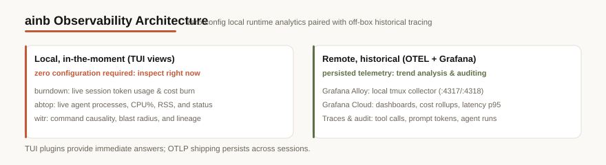

How to see what your agents are doing: what they cost, what's running, why a
process exists, and how to ship it all to Grafana Cloud.

| Tool | Answers | Surface |
|------|---------|---------|
| [Usage analytics (burndown)](/plugins/burndown) | "What am I spending: by day, project, model?" | `i` in the TUI · `ainb burndown` |
| [abtop](/plugins/abtop) | "What agent processes are running right now?" | `t` in the TUI · `ainb abtop` |
| [witr](/plugins/witr) | "Why is this process running: what spawned it?" | `w` in the TUI · `ainb witr` |
| [OpenTelemetry → Grafana Cloud](/reference/otel-grafana) | "Ship metrics/logs/traces off-box to dashboards" | `ainb otel setup` |

## Local vs remote

The first three are **local, in-the-moment** views: open them in the TUI and
read the answer now, no setup. OpenTelemetry is the **off-box, historical**
path: a local Grafana Alloy collector forwards Claude Code / Codex telemetry to
Grafana Cloud for cost dashboards, latency percentiles, and trace retention.

Start with the [OpenTelemetry guide](/reference/otel-grafana) for the
Grafana Cloud setup and example dashboards.
