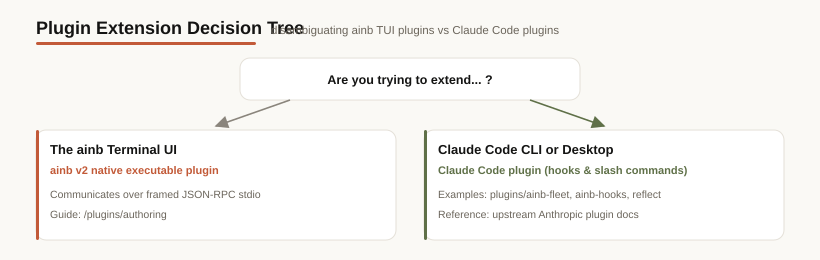

> **Read this first.** The word "plugin" means two different things in this monorepo. Picking the wrong path costs you hours.

---

## Two systems, same word

### 1. **ainb v2 plugins** (subprocess plugins for the TUI host)

What the rest of this directory documents.

- **Where they live:** `ainb-tui/crates/ainb-plugin-*/`
- **Distribution:** staged into `dist/plugins/<name>/` by `just stage-plugins`
- **Runtime:** the `ainb` TUI spawns each plugin as a native child process and talks JSON-RPC 2.0 over framed stdio
- **What they can do:** own a TUI screen, claim a CLI subcommand tree, publish/subscribe to snapshot topics, paint statusline segments
- **Capability model:** deny-by-default; manifest declares grants for filesystem, network, subprocess, event bus
- **Reference plugins:** `burndown` (analytics), `session-reader` (data backend), `witr` (process causality, wraps an external binary), and `abtop` (top-for-agents, real-time agent monitor): all ship in-tree as real subprocess plugins. (Notifications are **not** a plugin: the Inbox + `ainb-notifyd` daemon are host code compiled into `ainb-core`; see [TUI → Inbox & notifications](/tui/inbox-notifications).)

If you want to **add a screen / CLI / dashboard to the TUI**, you want this kind of plugin. Continue to:
- [overview.md](/plugins/overview): what a v2 plugin is, conceptually
- [user-guide.md](/plugins/user-guide): install, configure, troubleshoot
- [authoring.md](/plugins/authoring): write one
- [spec-v2.md](/plugins/spec-v2): the wire contract

### 2. **Host-agent plugins** (Claude Code / Codex / Copilot plugin systems)

A separate system owned by the host agents themselves. The monorepo ships host-agent plugins under `plugins/<name>/` at the repo root (not inside `ainb-tui/`); `reflect` was **extracted** into its own repo and ships from there:

- **[`reflect`](/toolkit/plugins/reflect)**: agent self-improvement + retrieval (skills + SessionStart/PostToolUse/Stop hooks). No longer in this monorepo: it now lives in [stevengonsalvez/ainb-reflect-memory](https://github.com/stevengonsalvez/ainb-reflect-memory) (plugin under `plugin/`) and is installed from that repo, not via `claude plugin install reflect@agents-in-a-box`.
- **[`ainb-fleet`](/toolkit/plugins/ainb-fleet)**: LLM-facing skill bundle teaching agents to drive `ainb fleet …` multi-session orchestration. `claude plugin install ainb-fleet@agents-in-a-box`
- **[`ainb-hooks`](/toolkit/plugins/ainb-hooks)**: emits Claude Code / Codex / Copilot lifecycle events to the ainb notification inbox (consumed by the [Inbox & notifications](/tui/inbox-notifications) daemon: host code, not a plugin); wired by `ainb-notifyd install`.
- **`caveman-stats`**: Claude Code statusline + compaction-survival hooks for upstream `caveman@caveman`.
- **`illustration`**: mascot-driven illustration skill bundle; no lifecycle hooks.

- **Distribution:** in-monorepo Claude Code plugins go through `.claude-plugin/marketplace.json` at the repo root, which the Claude Code CLI reads (reflect was removed from that marketplace and now ships from ainb-reflect-memory)
- **Runtime:** host agents load them as skill/hook bundles; the ainb TUI is not involved
- **Full docs:** [Toolkit → Claude Code plugins](/toolkit/plugins/overview): a page per plugin with how-it-works diagrams

If you want to **add behaviour to Claude Code itself**, you want a Claude Code plugin. Anthropic's authoritative reference is the [Claude Code plugin docs](https://docs.anthropic.com/en/docs/claude-code); the `plugins/*/` directories here (`ainb-fleet`, `ainb-hooks`) are working examples, and `reflect`'s plugin (in [ainb-reflect-memory](https://github.com/stevengonsalvez/ainb-reflect-memory) under `plugin/`) is another.

---

## Quick decision tree

---

## Why the name collision?

Historical accident. ainb's plugin system pre-dated Claude Code shipping its own. Both names are entrenched in their respective communities, so the monorepo carries the ambiguity and pays for it with this disambiguation note.

If you ever see a plain reference to "the plugin" in this repo without context, look at where it lives:
- `ainb-tui/crates/ainb-plugin-*` → ainb v2 plugin
- `plugins/<name>/` at root → Claude Code plugin (`ainb-fleet`, `ainb-hooks`)
- `reflect`'s plugin → no longer in this monorepo; it lives in [ainb-reflect-memory](https://github.com/stevengonsalvez/ainb-reflect-memory) under `plugin/`
- `toolkit/packages/plugins/` does **not** exist and was deprecated; the ainb-toolkit repo (which replaced the in-tree `toolkit/`) likewise has no `plugins/` directory.
