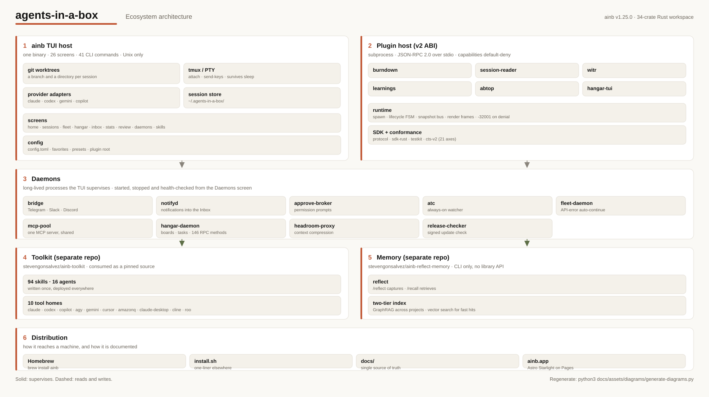

How the four components of agents-in-a-box fit together.

> For component-level deep dives, see [TUI architecture](/tui/architecture), [plugin spec v2](/plugins/spec-v2), and [knowledge system overview](/knowledge/overview).

---

## Ecosystem map



Solid arrows are data/control flow, dashed arrows are writes and feedback, clay is fleet prompt delivery, and olive is the learning loop. The small hops where lines cross are jump-overs: the lines do not connect.

---

## Box diagram

```
┌─────────────────────────────────────────────────────────────────────────┐
│                            ainb TUI host                                │
│                                                                         │
│   Rust · ratatui · tokio · 34 crates · Unix-only                        │
│                                                                         │
│   ┌──────────────┐  ┌──────────────┐  ┌─────────────────────────────┐  │
│   │   tmux/PTY   │  │  git/worktree│  │  plugin runtime (v2 ABI)    │  │
│   │              │  │              │  │                             │  │
│   │ - portable-  │  │ - git2       │  │ - per-plugin tokio task     │  │
│   │   pty        │  │ - worktree   │  │ - JSON-RPC over stdio       │  │
│   │ - capture +  │  │   manager    │  │ - capability dispatch       │  │
│   │   PTY wrap   │  │              │  │ - snapshot bus              │  │
│   └──────┬───────┘  └──────┬───────┘  └──────┬──────────────────────┘  │
│          │                 │                 │                          │
└──────────┼─────────────────┼─────────────────┼──────────────────────────┘
           │                 │                 │ framed JSON-RPC
           │                 │                 │
           ▼                 ▼                 ▼
   ┌──────────────┐   ┌────────────────┐  ┌─────────────────────────────┐
   │ AI providers │   │ ~/.agents-in-  │  │  In-tree plugin binaries    │
   │ launched in  │   │ a-box/         │  │   dist/plugins/<name>/      │
   │ tmux PTYs:   │   │ worktrees/     │  │                             │
   │              │   │ by-session/    │  │  - burndown                 │
   │ - Claude     │   │ <session-id>   │  │  - session-reader           │
   │ - Codex      │   │                │  │  - your plugin              │
   │ - Gemini     │   │ Each session   │  │                             │
   │ - Copilot    │   │ runs in its    │  │  Native binaries spawned    │
   │ - Kiro       │   │ own branch.    │  │  as child processes; only   │
   │ - shell      │   │                │  │  the capabilities they      │
   │ - SSH        │   │                │  │  declared in manifest.toml. │
   └──────────────┘   └────────────────┘  └─────────────────────────────┘


   ┌─────────────────────────────────────────────────────────────────────┐
   │              ainb-toolkit (external repo)                           │
   │   https://github.com/stevengonsalvez/ainb-toolkit                  │
   │                                                                     │
   │   Source of truth (flattened layout):                               │
   │   ├── skills/      94 skills                                        │
   │   ├── agents/      16 agents (universal, engineering, swarm, meta)  │
   │   ├── workflows/   structured delivery workflows                    │
   │   └── utilities/   shared hooks, config, output styles              │
   │                                                                     │
   │   Bootstrap engine (bootstrap.js) deploys to:                       │
   │   ┌─ ~/.claude/        ┌─ ~/.codex/        ┌─ ~/.copilot/           │
   │   ├─ ~/.gemini/        ├─ ~/.hermes/       ├─ ~/.amazonq/           │
   │   └─ PROJECT/.cursor/  └─ PROJECT/.cline/  └─ PROJECT/.roo/         │
   │                                                                     │
   │   ainb consumes ainb-toolkit as a pinned external source.           │
   │   Per-tool packaging is auto-detected from the toolkit catalog.     │
   └─────────────────────────────────────────────────────────────────────┘


   ┌─────────────────────────────────────────────────────────────────────┐
   │                       reflect-kb (knowledge)                        │
   │                                                                     │
   │   Two-tier learning capture + retrieval:                            │
   │                                                                     │
   │   ┌─────────────────────┐         ┌─────────────────────────────┐  │
   │   │ QMD (fast vector)   │         │ nano-graphrag (entity graph)│  │
   │   │ - hnswlib           │ ◄────►  │ - networkx + Louvain        │  │
   │   │ - per-learning      │         │ - cross-project queries     │  │
   │   │   embeddings        │         │ - community detection       │  │
   │   └─────────────────────┘         └─────────────────────────────┘  │
   │                                                                     │
   │   CLI:                                                              │
   │   /reflect    capture a learning                                    │
   │   /recall     retrieve relevant prior learnings                     │
   │   /ingest     bulk-index from memory dirs across tools              │
   │                                                                     │
   │   Installed via: uv tool install reflect-kb                         │
   └─────────────────────────────────────────────────────────────────────┘
```

---

## Data flow: a typical session

```
1. ainb run --repo . --worktree --tool claude --model sonnet
       │
       ▼
2. ainb creates a worktree at ~/.agents-in-a-box/worktrees/<branch>/
   ├─ symlink ~/.agents-in-a-box/worktrees/by-session/<id> → that path
       │
       ▼
3. ainb spawns a tmux session "<session-id>"
       │
       ▼
4. Inside that tmux pane, ainb launches `claude` with the worktree as cwd
       │
       ▼
5. ainb-toolkit skills/agents already deployed to ~/.claude/ are available to Claude
       │
       ▼
6. Session activity is captured to ~/.claude/projects/<wt>/sessions/<id>/*.jsonl
       │
       ▼
7. session-reader plugin chunked-publishes UsageDataEvent on
   `sessions.usage_data` topic; burndown plugin subscribes and renders
   the Analytics screen
       │
       ▼
8. When you /reflect on a learning, reflect-kb stores it under
   ~/.reflect/kb/learnings/ and indexes into both QMD + GraphRAG
```

---

## Where things live on disk

```
~/.agents-in-a-box/
├── sessions.json              session registry (TUI + CLI read this)
├── config/config.toml         user config
├── worktrees/
│   ├── by-session/<id>        symlink → real worktree
│   └── <branch>/              the actual worktree
├── repos/<host>/<owner>/<repo>  cloned remotes (TUI and CLI share this)
├── favorites.json             saved repos
├── plugins/<name>/            plugin-writable state (gated by capability)
└── logs/agents-in-a-box-*.jsonl   structured logs (host + plugin stderr)

~/.claude/
├── projects/<wt>/sessions/*.jsonl   per-session activity logs
└── skills/, agents/, …               ainb-toolkit-deployed assets

~/.reflect/
└── kb/
    ├── learnings/              captured QMD docs
    └── graph.graphml           GraphRAG entity graph

dist/plugins/<name>/            staged plugin binaries (built from in-tree
                                ainb-tui/crates/ainb-plugin-*)
```

---

## Boundary contracts

| Boundary | Contract |
|---|---|
| TUI ↔ AI provider | None. The TUI spawns the provider CLI in a tmux PTY and reads/writes the pane. |
| TUI ↔ plugin | [Plugin spec v2](/plugins/spec-v2): framed JSON-RPC over stdio. |
| TUI ↔ ainb-toolkit | None at runtime. ainb-toolkit is deployed ahead of time to `~/.<tool>/`; the TUI doesn't read it. ainb pins a release of `stevengonsalvez/ainb-toolkit` and the skill manager syncs from it. |
| Plugin ↔ Plugin | Snapshot bus (publish/subscribe) brokered by the TUI host. See spec §6. |
| reflect-kb ↔ anyone | CLI only. No library API. |

---

## See also

- [TUI architecture (deeper)](/tui/architecture)
- [Plugin wire spec](/plugins/spec-v2)
- [Toolkit overview](/toolkit/overview)
- [Knowledge system overview](/knowledge/overview)
