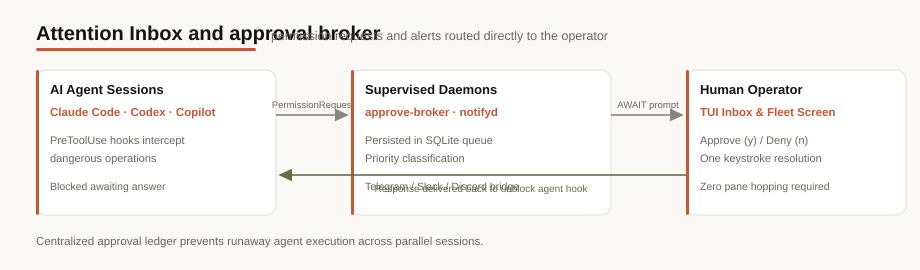

The **Inbox** screen, the per-session **status markers** (`[!]` / `[?]` / `[✓]`), and the **`ainb-notifyd`** daemon are all part of the `ainb` host binary: **not** an ainb plugin. This page is the single reference for how notifications work: the daemon captures Claude Code / Codex / Copilot lifecycle hook events into SQLite, and `ainb-tui` renders them two ways: the Inbox screen (full history) and a live per-session marker (the one row glyph that tells you a session needs you).

> **Agent support.** Claude Code is the primary, most-tested path (registered through the `claude` plugin CLI). Codex is wired via `~/.codex/hooks.json`; Copilot is wired via `~/.copilot/hooks/ainb.json`. Their user-facing events flow into the Inbox and mark matching sessions (`[✓]` / `[?]` / `[!]`), though Claude remains the better-exercised integration.

> **Why it's not a plugin.** The crate is *named* `ainb-plugin-notifyd` (it lives alongside the example plugin crates), but it has no `manifest.toml`, no JSON-RPC boundary, and is never spawned as a subprocess. `ainb-core` links it as an ordinary Rust path-dependency and compiles it straight into the host. Contrast with the real v2 subprocess plugins: `burndown`, `session-reader`, `witr`: which run as spawned child processes over stdio JSON-RPC and are governed by the capability gate. The **only** plugin in this feature is [`ainb-hooks`](/toolkit/plugins/ainb-hooks), and that is a plugin of the *host agent* (Claude Code / Codex / Copilot), installed into their config dirs: not a plugin of `ainb`.

*Press `b` in ainb to open the Inbox: captured Claude Code / Codex / Copilot lifecycle events with a list + detail pane, agent filter, and per-session unread counts.*

## How it works

The capture path starts outside ainb, in a thin bash hook (`notify.sh`). For **Claude Code** it is registered through the plugin marketplace: `ainb notifyd install` shells out to `claude plugin install ainb-hooks@agents-in-a-box`, so Claude resolves and runs the plugin's bundled `notify.sh`. For **Codex** a managed block is merged into `~/.codex/hooks.json` pointing at the canonical `~/.agents-in-a-box/hooks/notify.sh`. For **Copilot**, `ainb-notifyd` writes a standalone drop-in at `~/.copilot/hooks/ainb.json`. Only the **actionable** lifecycle events are registered: Claude uses `Notification` (idle / awaiting-input + permission prompts), Codex uses `PermissionRequest` (approval prompts), Copilot uses `notification`, and all three have a turn-finished hook (`Stop` / `agentStop`). When one fires, the script normalizes the payload into a JSON `Envelope` (`protocol_version`, `agent`, `raw_event`, `session_id`, `cwd`, `project`, `ts`, `payload`) and writes one newline-terminated line to the Unix socket at `~/.agents-in-a-box/notify.sock`. If the socket is absent it lazy-spawns the daemon; if delivery still fails it appends the envelope to `notify.fallback.jsonl`. The hook always exits `0` so a delivery failure never blocks the agent.

Telemetry events (`SessionStart`, `UserPromptSubmit`, `PreToolUse`, `PostToolUse`, `PreCompact`, `PostCompact`, `SubagentStart`, `SubagentStop`) are deliberately **not** hooked: `PostToolUse` alone fires dozens of times per turn and would bury the signal. So the inbox only ever contains things that need you.

`ainb-notifyd` is a tokio accept-loop daemon. On startup it replays (and clears) any queued `notify.fallback.jsonl`, then binds the `0600` socket and writes a PID file. Each accepted connection is parsed into an `Envelope` and checked against `is_user_facing`: non-actionable events (telemetry like `SessionStart` / `PostToolUse`) are **dropped before persistence**: a defensive second filter on top of the trimmed hook registration, so a stale install never accumulates noise either. User-facing events (`Stop`, `Notification`, `PermissionRequest`, `agent-turn-complete`, approval/wait events, etc.) are persisted via `insert_and_prune` and emitted as a native OS notification, debounced per `(session_id, raw_event)` on a 60s window.

Storage is a dedicated SQLite database, `~/.agents-in-a-box/notifications.db`, opened in WAL mode so the daemon (writer) and TUI (reader) never block each other. It is intentionally separate from `session-reader`'s `usage.db`: different lifecycles, independent migrations. A retention sweep runs on every insert (default: prune rows older than 7 days, cap the table at 10,000 rows, oldest first).

The render side lives in `ainb-core`. The **Inbox** screen (`components/inbox.rs`) holds a long-lived `Store` handle and re-queries SQLite on every render tick (cheap with WAL + `LIMIT 200`). It paints a two-pane list + detail view, and supports mark-read, dismiss, dismiss-all-visible, an archived toggle, and an agent filter. Separately, the Sessions screen reads recent store events to draw a live per-session **status marker** (`[!]` / `[?]` / `[✓]`) on each session row: see [Per-session status markers](#per-session-status-markers) below. Because `notifyd` is in-tree, it reaches the filesystem, the socket, and the OS notifier directly: there is no JSON-RPC boundary, no `plugin/render` / `plugin/cli_dispatch`, and no `host/snapshot/publish`.

## Per-session status markers

The Inbox is the full history; the **status marker** is the at-a-glance signal. Every session row in the Sessions screen shows one marker (or nothing), recomputed from the same hook events so you can see across the whole fleet which sessions need you without opening the Inbox. It is **sparse by design**: a session with no pending event shows nothing.

*Live markers: a Codex session that just finished its turn shows `[✓]`; a Claude session awaiting input shows `[?]`. Idle sessions with nothing pending stay blank.*

The agents register the same intent, but not the same raw hook names. The mapping:

### Claude Code

| Hook fired | Marker | Means | Shows until |
|------------|--------|-------|-------------|
| `Notification` | `[?]` amber | awaiting input: asked a question, needs permission, or the prompt sat idle (~60s) | the agent resumes generating · you attach · a newer `Stop` supersedes it: **no TTL** |
| `Stop` | `[✓]` green | turn finished: over to you | **5-minute TTL** · the agent resumes · you attach · a newer event |
| `PermissionRequest` | `[!]` red | blocked on tool approval | the agent resumes · attach. Fires only on sessions with the **fleet plumbing** hook set installed (fleet-managed sessions register `PermissionRequest` there); the plain notifyd install folds permission into `Notification`, which reads as `[?]`. On fleet sessions this hook also *blocks* for a live approve/deny: see [Permission approve/deny round-trip](#permission-approvedeny-round-trip) |
| `SessionStart` · `UserPromptSubmit` · `PostToolUse` · `PreCompact` | *(none)* | telemetry: not hooked by the notifyd install (fleet plumbing registers `SessionStart`/`UserPromptSubmit` to drive the fleet panel's `STARTING`/`RUNNING` states) |: |

### Codex

| Hook fired | Marker | Means | Shows until |
|------------|--------|-------|-------------|
| *(none: Codex has no `Notification` hook)* | `[?]` amber | awaiting input | **not shown today**: Codex permission prompts use `PermissionRequest`; turn completion uses `Stop` |
| `Stop` (aliases `agent-turn-complete`, `task_complete`) | `[✓]` green | turn finished | **5-minute TTL** · resumes · attach |
| `PermissionRequest` | `[!]` red | blocked on exec/patch approval | clears when the agent resumes · attach |
| `SessionStart` · `UserPromptSubmit` · `PreToolUse` · `PostToolUse` · `PreCompact` · `PostCompact` · `SubagentStart` · `SubagentStop` | *(none)* | telemetry: not hooked |: |

### GitHub Copilot CLI

| Hook fired | Marker | Means | Shows until |
|------------|--------|-------|-------------|
| `notification` | `[?]` amber | awaiting input or permission prompt | the agent resumes · you attach · a newer `agentStop` supersedes it: **no TTL** |
| `agentStop` | `[✓]` green | turn finished | **5-minute TTL** · resumes · attach |

While a session is **actively generating**, the marker is suppressed (the busy state covers it). The marker recomputes every **~5 s** (the preview-refresh tick), so every appear/clear lands on that cadence rather than instantly.

**Does it clear when I answer?** Yes: answering a session (typing a prompt, or approving a permission) makes the agent start responding, and the marker clears on the next ~5 s refresh once it does. It clears via *the agent resuming*, not the keystroke itself, so there's a ≤5 s window between hitting enter and the marker disappearing. **Attaching** to a session clears it immediately and advances a per-session baseline to "now", so it won't re-mark until *new* activity arrives after you look away.

Markers are matched to sessions by **working directory + agent**: each hook event carries the `cwd` it fired in, joined to the ainb session whose `workspace_path` matches (trailing-slash tolerant). Only events within a rolling **6-hour window** count: so opening ainb immediately surfaces sessions that were already waiting before you launched it (the `[✓]` TTL keeps long-finished turns from piling up, so only genuinely-pending `[?]` / `[!]` survive).

## Permission approve/deny round-trip

Fleet-managed Claude sessions get a **synchronous, first-class permission gate**: when Claude fires a `PermissionRequest` hook, the hook process *blocks* on notifyd's approve socket until a human approves or denies it: from the fleet panel, the CLI, or not at all (timeout ⇒ deny). The answer flows straight back to Claude as the hook's `hookSpecificOutput` permission decision, so approving in the TUI is exactly as authoritative as pressing `y` in the Claude session itself.

- **Fleet panel (TUI)**: press `f` on the home screen. A session blocked on approval shows the gold **`APRV`** badge (a freshly booting one shows blue **`STRT`**); select the row and press **`y`** to approve or **`n`** to deny.
- **CLI**: `ainb fleet approve` with no argument lists the sessions currently waiting (with tool, context, and wait time; `--format json` for scripting). `ainb fleet approve <session-id>` / `ainb fleet deny <session-id> [--reason "…"]` delivers the decision; a no-waiter miss exits non-zero.

### Fault tolerance: no hook is ever lost

The waiting side is built to survive every failure mode without silently green-lighting a tool call:

- **Timeout ladder**: the broker holds an AWAIT for up to 600 s; the waiting hook re-dials until 640 s; Claude's own hook timeout is registered at 660 s. Each layer answers before the one above kills it, and an unanswered wait falls back to **deny**: never auto-approve.
- **Dead or restarted socket**: the blocked hook re-dials `approve.sock` every 500 ms until its deadline. If notifyd dies mid-wait, the prompt isn't lost: the moment a fresh daemon binds the socket, every still-waiting hook re-registers itself.
- **Single resume/repair command**: `ainb notifyd restart` (CLI) or **`R`** in the [Daemons overlay](/tui/daemons) stops the owner, reaps strays, respawns, and waits for `approve.sock` to bind. Because of the re-dial loop, that one command repairs the socket *and* resumes every pending prompt.
- **Observability**: the approve broker is a first-class row in `ainb fleet daemons`, with the live pending-waiter count in its health reason (`serving: 2 pending requests`), and notifyd's processes are listed in the `d` overlay.

## Host resources it touches

Because this is host code, there is **no manifest and no capability declaration**: the capability gate that governs subprocess plugins does not apply. It reaches the filesystem, the socket, and the OS notifier directly. For reference, the host-side resources it touches are:

| Resource | Why it is needed |
|----------|------------------|
| `~/.agents-in-a-box/notifications.db` (SQLite, read+write) | Persist captured envelopes; back the Inbox list and the unread badge. |
| `~/.agents-in-a-box/notify.sock` (Unix socket, `0600`) | Receive envelopes from the `ainb-hooks` script. |
| `~/.agents-in-a-box/notify.pid`, `notify.fallback.jsonl` | Single-instance guard; recover events queued while the daemon was down. |
| `~/.agents-in-a-box/approve.sock` (Unix socket, `0600`) | The **approve broker**: blocked `PermissionRequest` hooks park here awaiting a human approve/deny from the fleet panel or CLI. Rides notifyd's process; visible as its own row in `ainb fleet daemons`. |
| `claude` CLI (subprocess), `~/.codex/hooks.json` (read+write), `~/.copilot/hooks/ainb.json`, `~/.agents-in-a-box/hooks/notify.sh` | The `install` / `uninstall` verbs wire the hook into the host agents: Claude via `claude plugin install/uninstall`, Codex via a managed `hooks.json` block, Copilot via a standalone drop-in. |
| `osascript` / `notify-send` (subprocess) | Emit the native OS notification for user-facing events. |

## Using it

*The Inbox is a first-class home-screen surface: `b` from anywhere, or `Enter` on the sidebar tile.*

- **Discoverability surfaces**: three places advertise the Inbox so users don't have to memorise a hidden shortcut:
  - The home screen sidebar lists `📥 Inbox  [b]` between Sessions and Recovery: press `Enter` on the tile, or `b` globally, to open it. (`b` for "in-**B**ox": picked to avoid the case-pair confusion between `i` Stats and the earlier `I` Inbox binding.)
  - The bottom menu bar (every split-pane screen) always shows `b inbox`. When the store has unread + non-dismissed events the hint becomes `● N · b inbox`, so the global unread count is visible even when the Inbox screen is closed.
  - The Sessions screen renders a live **status marker** (`[!]` / `[?]` / `[✓]`) on the row of any session with a pending hook event, matched by `cwd` ↔ `workspace_path`. This is the primary surface: notifications are tied to the session that produced them, not a separate destination. See [Per-session status markers](#per-session-status-markers).
- **Inbox screen**: press **`b`** from anywhere on the home screen, or `Enter` on the `📥 Inbox` sidebar tile. You get a two-pane list + detail view of captured events. Keys inside the Inbox: `↑`/`↓` (or `k`/`j`) move, `PageUp`/`PageDown` jump 10 rows, `Enter` open + mark read **and jump to the matching session's tmux pane** (via the cwd correlation below), `d` dismiss selected, `Shift+C` dismiss every visible row, `a` toggle archived (dismissed) rows, `p` cycle the agent filter (all → claude → codex → copilot), `r` force refresh, `q`/`Esc` back.
- **cwd-based correlation (jump-to-tmux)**: every envelope carries the agent's `cwd` at hook-fire time, and every ainb `Session` carries a `workspace_path`. When the user presses `Enter` on an Inbox row, notifyd resolves the row's `cwd` to the first ainb workspace whose path matches (exact or `workspace_path/`-prefix to cover worktree subdirs), picks a session in that workspace, and queues an `AttachToOtherTmux` action with that session's `tmux_session_name`. There is no shared session-id namespace between the host agents' `session_id` strings and ainb's `Session.id` `Uuid`; the cwd is the bridge.
- **Daemon + installer CLI**: the verbs live both on the standalone `ainb-notifyd` binary and as the **`ainb notifyd …` subcommand** on the main `ainb` binary (both delegate to the identical `ainb_plugin_notifyd` functions, so they can never diverge). The alias exists because `notify.sh`'s lazy-spawn invokes `ainb notifyd`: the host binary is the one guaranteed to be on `PATH` after a normal install. Verbs (both forms work):
  - `ainb-notifyd run` (or `ainb notifyd run` / bare `ainb notifyd`): run the daemon in the foreground. The hook script lazy-spawns `ainb notifyd` when the socket is missing; if `ainb` is on `PATH` the daemon auto-starts and the event is delivered live (no fallback file).
  - `ainb-notifyd install --claude --codex --copilot` (or `--all`): install the `ainb-hooks` hook for the chosen agents.
  - `ainb-notifyd uninstall --claude --codex --copilot` (or `--all`): reverse the install; preserves user-authored Codex hooks and other Copilot hook files.
  - `ainb-notifyd status`: report per-agent install state, hook-script health, socket liveness, last event, and daemon PID liveness. `--format json` emits `{agents, daemon: {pid, running}}` for scripting.
  - `ainb-notifyd stop`: send `SIGTERM` to a running daemon via its PID file.
  - `ainb-notifyd restart`: stop the owner, reap strays, respawn, and wait for the approve socket to bind: the **single resume/repair command** for a dead or wedged approve socket (see the [round-trip section](#permission-approvedeny-round-trip) for why waiting prompts survive it).
  - `ainb-notifyd reap`: kill orphaned/wedged notifyd strays, sparing the live owner.
  - Every verb accepts `--format` (default `text`) for scripting: e.g. `ainb notifyd status --format json`. The host form takes `text|json|csv|markdown`; the standalone `ainb-notifyd` binary takes `text|json`.
- **Snapshot topics**: none. `notifyd` does not publish or subscribe on the event bus; the Inbox reads SQLite directly. There is no slash command.

## Source

`crates/ainb-plugin-notifyd`: in-tree library + `ainb-notifyd` daemon binary: envelope wire format, the SQLite `Store` (`recent_since` backs the markers), event→marker classification (`classify_attention`), the tokio listener, OS-notify dispatch, and the `ainb-hooks` install/uninstall logic (Claude via the `claude` CLI). The Inbox screen lives in `crates/ainb-core/src/components/inbox.rs`; the per-session marker logic (`attention_for_session` / `refresh_attention_markers`) lives in `crates/ainb-core/src/app/state.rs`. Diagram generated via /fireworks-tech-graph.
